# vegas-cut

Herramientas para agilizar la edición en VEGAS Pro 20, inspiradas en AutoCut.
El plan completo está en [`docs/plan.md`](docs/plan.md).

| Script | Para qué |
|---|---|
| `PrepararEpisodio.cs` | De una pasada: quita silencios, transcribe, guarda la copia BASE y abre MomentosIA. |
| `ProducirCapitulo.cs` | Del material a un capítulo de serie: análisis, 3 propuestas, propuesta final y armado. |
| `PulirEpisodio.cs` | Mide el ritmo contra la serie, estructura y narración provisional, placeholders. |
| `PasoFinal.cs` | Lo último: rellenar la música, bajar el juego bajo la narración, balancear y censurar. |
| `VariosPOV.cs` | El video de otro jugador: sincronizarlo por el audio y mostrarlo en los mejores momentos. |
| `programas/Memes.exe` | Programa aparte (fuera de Vegas) para tu biblioteca de memes: clasificar una carpeta deslizando como en Tinder y corregir lo que ya tienes. |
| `LimpiarVegasCut.cs` | Manda a la Papelera lo que se junta al trabajar y ningún proyecto usa (temporales, narración provisional, renders). |
| `QuitarSilencios.cs` | Quita las pausas de una o varias pistas de voz. |
| `ConfigurarVegasCut.cs` | Clave de Gemini y ruta de Faster-Whisper-XXL (una sola vez). |
| `Transcribir.cs` | Texto con tiempos por palabra y nivel de sonido de cada pista, en tu PC. |
| `MomentosIA.cs` | Gemini sugiere resumen, momentos, un corte a la duración que pidas, textos y Shorts. |
| `ReubicarMarcadores.cs` | Vuelve a poner los marcadores de MomentosIA sobre su clip si moviste clips. |
| `TextosDesdeMarcadores.cs` | Convierte los marcadores `TEXTO:` en Títulos y texto con el estilo de una plantilla. |
| `MusicaAutomatica.cs` | Baja la música cuando alguien habla y la sube en las pausas (envolvente de volumen). |
| `Series.cs` | Administra series de varias partes: capítulos en orden, notas y fichas para la IA. |
| `Anteriormente.cs` | Arma el «Anteriormente» con frases de episodios pasados que importan para este capítulo. |
| `DesenlazarClips.cs` | Arregla clips que quedaron unidos todos en un grupo tras cortar con versiones anteriores. |
| `CensurarPalabrotas.cs` | Tapa las palabrotas con un pitido o el efecto que elijas y silencia la voz justo ahí. |
| `ExportarProyecto.cs` | Exporta proyectos a JSON para estudiar patrones de edición. |

**Flujo para una serie de TV (como SCR):** *PrepararEpisodio* → *ProducirCapitulo* (desde la copia
BASE) → grabar la narración con el guion → *Reemplazar placeholders* (PulirEpisodio) → *PasoFinal*.

**Flujo sugerido para un gameplay:** *PrepararEpisodio* (o *Quitar silencios* → *Transcribir*) →
*Momentos con IA* → revisar → *Aplicar corte* → tus ajustes a mano → *Textos desde marcadores*
→ música → *Música que baja sola* → *Censurar palabrotas*. La transcripción sigue los cortes que hacen estas
herramientas, incluso si los deshaces con Ctrl+Z. Si después editas a mano no hace falta volver a
transcribir: los textos usan los marcadores anclados y la música mide las voces en el momento.

## Estructura

- `scripts/`: los scripts listos para Vegas (*generados* desde `src/`, no se editan a mano)
- `src/`: código fuente; `src/comun` se comparte entre herramientas
- `herramientas/compilar.py`: arma `scripts/*.cs` desde `src/` (un archivo por herramienta)
- `ejemplos/`: proyectos `.veg` reales para estudiar patrones de edición
  - `avatar/`: video ensayos con avatar
  - `minecraft/`: gameplays y shorts de Minecraft
- `docs/`: plan, patrones de edición y notas
- `pruebas/`: pruebas sin Vegas (`sh pruebas/ejecutar.sh`, requiere mono)

## Instalación

Los scripts no se instalan: son archivos `.cs` que Vegas compila al ejecutarlos.

- **Sin instalar:** *Herramientas → Secuencias de comandos → Ejecutar secuencia de comandos…*
  y eliges el `.cs` en la carpeta `scripts/` del repositorio.
- **En el menú (recomendado):** copia los `.cs` a `Documentos\Vegas Script Menu\` (crea la
  carpeta si no existe) y reinicia Vegas, o usa *Herramientas → Secuencias de comandos →
  Volver a examinar la carpeta del menú de secuencias de comandos*. Aparecen en
  *Herramientas → Secuencias de comandos*.
- **Atajo de teclado o botón:** *Opciones → Personalizar teclado*, busca el nombre del script y
  asígnale una tecla; o *Opciones → Personalizar barra de herramientas* para poner un botón.

Al actualizar el repositorio (`git pull`), vuelve a copiar los `.cs` si usas la carpeta del menú.

## Scripts

### `ConfigurarVegasCut.cs`

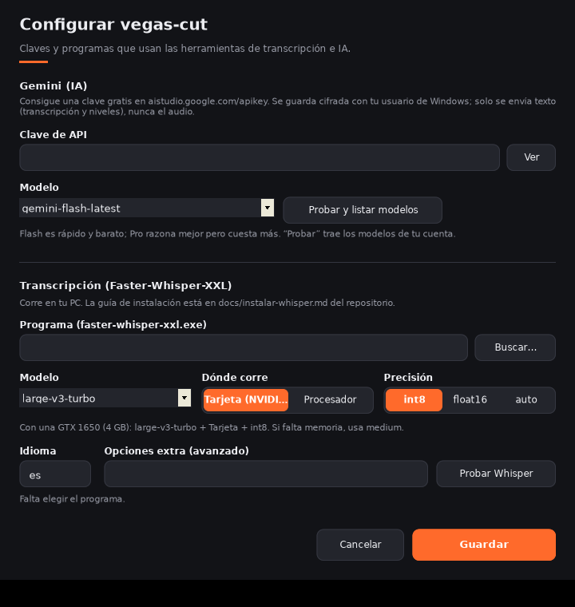

Se ejecuta una vez (y cuando quieras cambiar algo). Guarda en `%APPDATA%\vegas-cut\config.json`:

- **Clave de Gemini**, cifrada con tu usuario de Windows (DPAPI). Consíguela gratis en
  [aistudio.google.com/apikey](https://aistudio.google.com/apikey). *Probar y listar modelos*
  comprueba la clave y trae los modelos disponibles para tu cuenta.
- **Faster-Whisper-XXL**: ruta del `.exe`, modelo, tarjeta o procesador y precisión.
  Guía: [`docs/instalar-whisper.md`](docs/instalar-whisper.md).

### `Transcribir.cs`

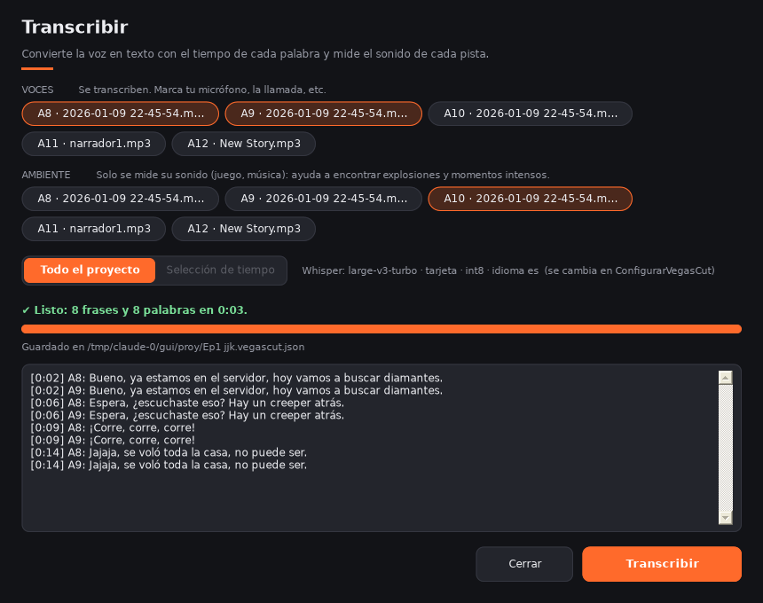

1. Guarda el proyecto.
2. Marca las **voces** (se transcriben; cada pista es una persona) y el **ambiente** (juego,
   música: solo se mide su sonido para detectar explosiones y momentos intensos).
3. **Transcribir**: Vegas renderiza cada pista y Faster-Whisper-XXL la transcribe en segundo
   plano, con progreso y tiempo restante. Se puede cancelar.

Resultado: `<proyecto>.vegascut.json` junto al `.veg`, con frases, palabras con su tiempo,
quién habla y el nivel de sonido por segundo de cada pista. El audio no sale de tu PC.

### `MomentosIA.cs`

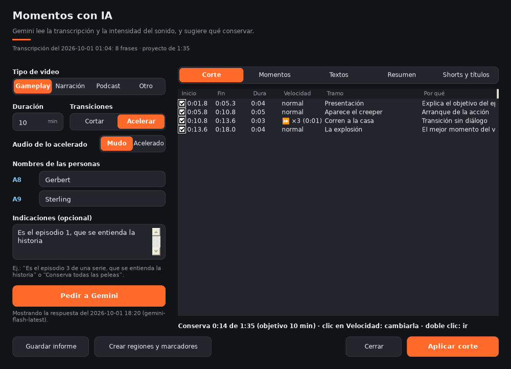

Necesita la transcripción y la clave de Gemini.

1. Elige el **tipo de video**, la **duración mínima y máxima**, los **nombres** de las personas
   y, si quieres, **indicaciones de este episodio** ("es el episodio 3, que se entienda la historia").
   - **Reglas del canal…**: reglas que aplican siempre, en todos los videos, para no escribirlas cada
     vez. Vienen unas de base (empezar sin perder tiempo, nada de conversaciones personales o de vida
     amorosa, nada de problemas técnicos, mantener el hilo entre escenas, no cortar chistes a la
     mitad, terminar con clímax o suspenso). Se editan y se guardan en `config.json`.
   - **Episodios anteriores…** (opcional): eliges respuestas de MomentosIA de otros videos de la
     serie y su resumen se envía como contexto para entender la historia.
   - **Modelo**: se elige aquí mismo. *Lite* es barato pero sigue peor las reglas y la duración.
   - **Transiciones: Cortar o Acelerar.** Con *Acelerar*, Gemini puede marcar tramos con poca
     conversación (viajar, minar, construir) para verse ×2–×4 en vez de desaparecer, así la historia
     no da saltos. **Audio de lo acelerado:** mudo (recomendado) o acelerado.
2. **Pedir a Gemini**: se envía solo texto (transcripción con tiempos e intensidad del sonido
   cada 5 s). Tarda uno o dos minutos.
   - **Videos largos (más de 35 min) se analizan por partes** de unos 20 min, cortando en la
     pausa más larga: cada parte elige candidatos (con importancia 1–10) y resume lo que pasa,
     sabiendo lo que pasó antes; una pasada final arma el corte completo cuidando la historia.
     Si una respuesta llega incompleta se reintenta, y si no cupo se pasa solo al modo por partes.
   - **Revisión:** una segunda pasada solo comprueba que cada tramo cumpla las reglas y las
     indicaciones, y quita o recorta los que no (aparecen desmarcados con ⚠ y el motivo).
   - **Duración garantizada:** si el corte pasa del máximo, se desmarcan los tramos de menor
     importancia (nunca el primero ni el último); si no llega al mínimo, se agregan los mejores
     candidatos que no se usaron. Todo queda visible y lo puedes cambiar.
3. Revisa las pestañas y desmarca lo que no quieras:
   - **Corte**: tramos a conservar, en orden, cerca de la duración objetivo. Los bordes se
     ajustan para no partir palabras. La columna **Velocidad** dice si un tramo va normal o
     acelerado; un clic en ella la cambia (normal → ×2 → ×3 → ×4 → normal).
   - **Momentos**: los mejores, con nota del 1 al 10 y por qué.
   - **Textos**: frases cortas ("3 horas después…") para lo que el corte se salta.
   - **Resumen** y secciones, **Shorts** y **títulos**.
   Doble clic en una fila mueve el cursor de Vegas a ese punto.
4. Acciones:
   - **Crear regiones y marcadores** para revisar en la línea de tiempo.
   - **Aplicar corte**: quita todo lo que no está marcado y acelera los tramos acelerados, en
     todas las pistas (hazlo antes de poner música), y deja los textos y momentos como
     marcadores en su nuevo lugar. Ctrl+Z lo deshace. Vegas permite hasta ×4 por evento.
     El material sin cortar siempre queda guardado:
     - si el proyecto todavía no tiene copia `… BASE.veg`, la guarda antes de cortar;
     - si estás en la BASE, te ofrece guardar el corte en una copia nueva `… MOM.veg` (o
       `MOM 2`, `MOM 3`…) con su transcripción y su serie, y seguir ahí. La BASE no se corta.

       Las copias `MOM` cuentan como el mismo capítulo de la serie.
   - **Guardar informe**: `<proyecto>.vegascut-informe.md` con todo lo anterior.
   - **Conservar tramo…** (tramos fijos): escribe desde y hasta (`57:00` y `1:09:30`) un tramo que
     quieres completo, por ejemplo una carrera donde casi no hablan. Si antes de abrir MomentosIA
     dejaste una selección de tiempo o clips seleccionados en Vegas, ya viene llenado. Entra al
     corte tal cual, los tramos de la IA que caían adentro se absorben, y si el corte se pasa del
     máximo se desmarcan otros tramos, nunca el fijo. No hace falta volver a pedir a Gemini; en
     las próximas peticiones también se le avisa. Desmárcalo en la lista para quitarlo. Se elige
     **antes** de aplicar el corte (si ya lo aplicaste: Ctrl+Z y vuelve a abrir MomentosIA).
     Con **Los fijos cuentan en la duración** activo, todo el corte queda entre el mínimo y el
     máximo; apagado, los fijos van aparte y el mínimo y el máximo son solo para el resto.

**Tiempos en las indicaciones:** puedes escribir `57:00` o `1:09:30`; a Gemini se le manda también
en segundos, que es como ve la transcripción. Las frases que Whisper inventa en los silencios
(«¡Suscríbete al canal!», «Gracias por ver») no se le mandan.

**Historial:** cada respuesta se guarda en `<proyecto>.vegascut-ia-historial/` (y la última en
`<proyecto>.vegascut-ia.json`). Al abrir se muestra la última, y en *Respuesta* puedes elegir
cualquier anterior. Si el proyecto cambió desde esa respuesta (por ejemplo, aplicaste el corte),
se puede revisar pero no aplicar; deshaz con Ctrl+Z y vuelve a abrir para aplicarla otra vez.

**Marcadores anclados:** los marcadores y regiones que crea MomentosIA guardan a qué archivo y a
qué segundo del archivo corresponden (`<proyecto>.vegascut-marcas.json`). Si mueves, cortas o
reordenas clips, ejecuta **ReubicarMarcadores** y vuelven a quedar sobre su clip. En el plan gratuito de Gemini, Google puede usar
lo que envías para mejorar sus productos.

### `TextosDesdeMarcadores.cs`

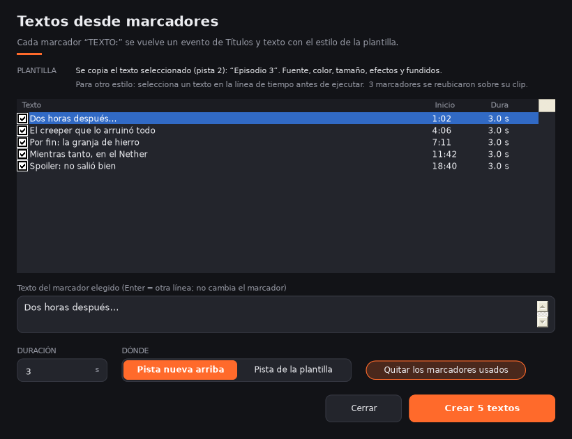

Convierte cada marcador `TEXTO: ...` (los que crea MomentosIA, o uno que pongas tú con esa
etiqueta) en un evento de **Títulos y texto**.

1. Haz un texto con el estilo que quieras (fuente, color, tamaño, efectos del evento, fundidos)
   y **selecciónalo** en la línea de tiempo. Si no seleccionas ninguno se usa el texto más
   cercano al cursor; si el proyecto no tiene textos, Títulos y texto con su estilo normal.
2. Ejecuta el script. Primero reubica los marcadores anclados, por si moviste o recortaste clips.
3. Revisa la lista: desmarca los que no quieras y corrige el texto abajo (Enter = otra línea).
4. Elige la **duración** (por defecto la de la plantilla), si van en una **pista nueva arriba** o
   en la de la plantilla, y si se **quitan los marcadores** ya usados. Un texto termina antes si
   el siguiente empieza, para que no se encimen.
5. **Crear**: cada texto es un medio propio (editar uno no cambia los demás). Ctrl+Z lo deshace.

Se copian todos los parámetros de la plantilla y se cambia solo el texto, conservando el
formato del primer carácter. Si la plantilla tiene animación con fotogramas clave, conviene
que dure lo mismo que los textos nuevos.

### `MusicaAutomatica.cs`

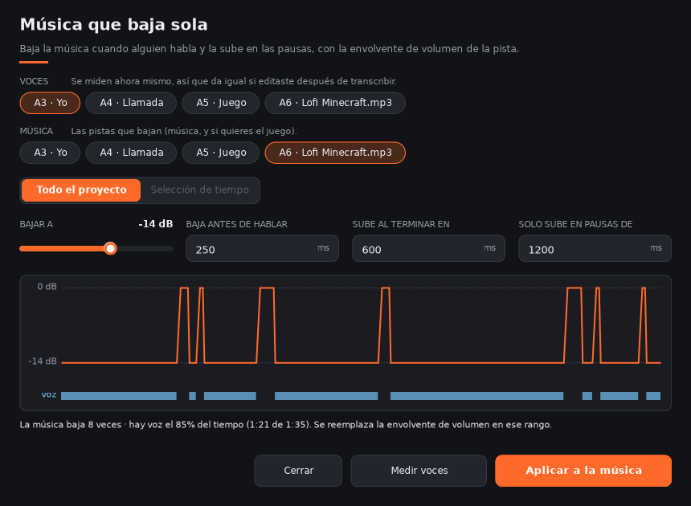

Baja la música mientras alguien habla y la vuelve a subir en las pausas (*ducking*), con puntos
en la **envolvente de volumen** de la pista, que después puedes mover a mano.

1. Pon la música en su pista (si el corte cambia, hazlo al final).
2. Marca las **voces** (se proponen las que transcribiste) y la **música** (se proponen las
   pistas con mp3, ogg… o con "música" en el nombre). También puedes bajar el juego.
3. **Medir voces**: renderiza cada voz y detecta cuándo hablan, con el mismo umbral por pista
   que *Quitar silencios*. Mide en ese momento, así que sirve aunque hayas editado.
4. Ajusta mirando la gráfica: **bajar a** (−14 dB por defecto), **baja antes de hablar**
   (250 ms), **sube al terminar en** (600 ms) y **solo sube en pausas de** (1200 ms: en pausas
   más cortas se queda abajo para que no suba y baje a cada rato).
5. **Aplicar a la música**: reemplaza la envolvente de volumen en el rango (todo el proyecto o la
   selección de tiempo); fuera del rango no se toca. Ctrl+Z lo deshace.

Los ajustes se recuerdan en `%APPDATA%\vegas-cut\musica.ini`.

### `CensurarPalabrotas.cs`

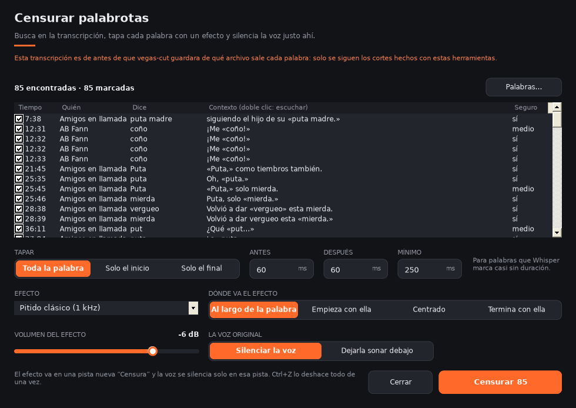

Al final de la edición: busca palabrotas en la transcripción, las muestra para revisarlas y
las tapa.

1. Revisa la lista: cada coincidencia con quién la dijo, el contexto y qué tan seguro estaba
   Whisper. Desmarca las que no quieras; **doble clic** lleva el cursor ahí y reproduce.
2. **Palabras…** edita la lista (se guarda en `%APPDATA%\vegas-cut\censura-palabras.txt`):
   una por línea, `ching*` acepta cualquier terminación (chingar, chingados…) y varias palabras
   son una frase (`puta madre`). La lista inicial está pensada para tus gameplays y no incluye
   palabras con doble sentido sueltas (*madre*, *huevos*, *perra*, *culo*): «¡Madre mía!» no se
   censura, «puta madre» sí.
3. **Cuándo tapar**: toda la palabra, solo el inicio o solo el final; **antes** y **después**
   (ms de margen) y un **mínimo** (Whisper a veces marca palabras casi sin duración).
4. **Efecto**: pitido clásico de 1 kHz (lo genera el script), un archivo tuyo (*Elegir archivo…*,
   se recuerdan los últimos) o ninguno. Va **al largo de la palabra** (recortado) o entero:
   **empieza con ella**, **centrado** o **termina con ella**. Con su **volumen**.
5. **La voz original**: se silencia solo en la pista de quien la dijo (las demás voces siguen),
   o se deja sonar debajo del efecto.
6. **Censurar**: los efectos van en una pista nueva *Censura*. Palabrotas seguidas se tapan con
   un solo efecto. Ctrl+Z lo deshace todo.

**Sigue tus ediciones a mano:** MomentosIA y Censurar ubican cada palabra por su archivo y su
segundo, así que si cortas, mueves o estiras clips a mano no hace falta volver a transcribir.
Para eso, *Transcribir* guarda de qué archivo y de
qué segundo sale cada parte de la voz, así que cada palabra se encuentra en su lugar actual
aunque muevas o recortes clips; si una parte se borró, aparece como *ya no está*. Las
transcripciones anteriores solo siguen los cortes hechos con estas herramientas: si editaste a
mano, vuelve a transcribir (un video ya editado de 20 min tarda poco).

### `Series.cs`

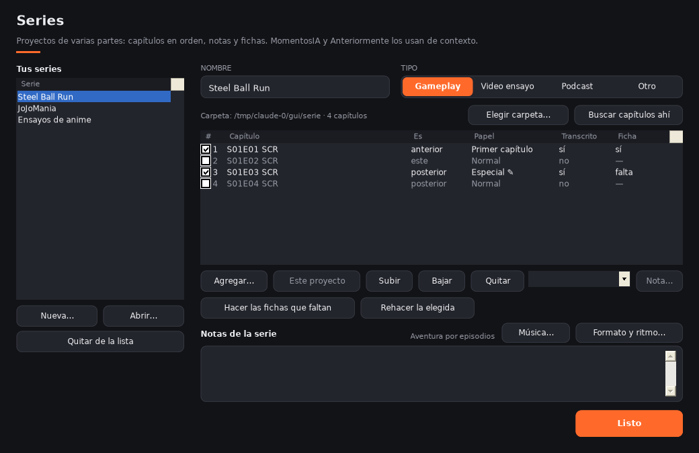

Para proyectos de varias partes de cualquier tipo: gameplays, video ensayos, podcast…

- **Nueva…**: le pones nombre y eliges la carpeta de la serie. Ahí se guarda el archivo de la
  serie (`<nombre>.vegascut-serie.json`), así viaja con tus proyectos, y se buscan sus capítulos.
  vegas-cut recuerda tus series para que aparezcan en la lista; **Abrir…** trae una que no esté.
- **Capítulos en orden**: **Buscar capítulos ahí** agrega los `.veg` de la carpeta (y
  subcarpetas) que traen `S01E02`, `Parte 2`, `Cap 2` o `Ep 2` en el nombre; **Agregar…** suma
  cualquier `.veg`, se llame como se llame; **Subir** y **Bajar** cambian el orden. Las casillas
  dicen qué capítulos usar de contexto en el proyecto abierto.
- **Tipo** (gameplay, video ensayo, podcast, otro): cambia lo que Gemini anota en las fichas
  (en un video ensayo: temas, argumentos y conceptos que se retoman).
- **Fichas**: «Hacer las fichas que faltan» le pide a Gemini, una sola vez por capítulo, un
  resumen con los **hilos abiertos**, lo **recurrente** y **frases clave** con su tiempo, de lo
  que quedó en el video. Se guarda junto al proyecto de ese capítulo
  (`<proyecto>.vegascut-ficha.json`). «Rehacer la elegida» la vuelve a hacer.
- **Notas de la serie**: personajes, apodos y lugares.
- **Música…**: la música de la serie.

  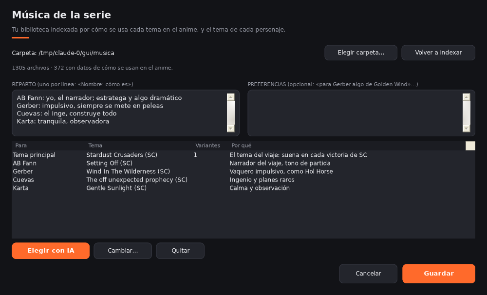

  - **Indexar** recorre la carpeta de tu música (y sus subcarpetas) y lee las etiquetas de cada
    archivo. Empareja cada tema con su uso en el anime: 489 temas con las escenas donde suenan,
    incluidos en el script, también con otras traducciones («Fire Shaman» es «The Magician of
    Fire»). Le pone a cada uno:
    - el **estado de ánimo**: viaje, calma, comedia, misterio, tensión, villano, pelea, épico,
      victoria o tristeza;
    - **dónde suele ir**: inicio, medio, final, avance o eyecatch;
    - de qué **personaje** es tema;
    - sus **variantes**: la misma canción en otra versión u otro álbum.

    Los que no están en el anime se clasifican por su título. El índice se guarda en
    `musica-indice.json`, dentro de la carpeta de la música; con tu biblioteca quedan 372 de
    1305 archivos con datos del anime.
  - **Más música (juegos, fanmade, remixes).** Ponla en subcarpetas dentro de la carpeta de la
    música (por ejemplo `Juegos/Minecraft`, `Fanmade/SBR`) y pulsa **Volver a indexar**. Después:
    - **Etiquetar con IA**: Gemini dice el ánimo, dónde queda mejor y cómo suena cada archivo que
      no es del anime, por lo que sabe del tema (la OST de Minecraft, Zelda, Undertale…) o por su
      título, álbum y carpeta. Los que no conoce los deja sin etiquetar (mejor nada que
      inventar).
    - **Por carpeta**: si una subcarpeta se llama como un ánimo (`Pelea`, `Calma`, `Misterio`,
      `Comedia`, `Triste`, `Épico`, `Jefe`, `Viaje`…), sus archivos toman ese ánimo sin preguntar.

    Lo etiquetado se guarda en el índice y no se pierde al volver a indexar. Desde ahí, esos
    archivos entran en la música que se elige al producir y al rellenar.
  - **Reparto**: un personaje por línea («Gerber: impulsivo, siempre pelea»).
  - **Elegir con IA**: Gemini elige el **tema principal** de la serie y **un tema para cada
    personaje**, sin repetir y con sus variantes. Usa la personalidad de cada uno, la premisa y
    tus **preferencias** («para Gerber algo de Golden Wind»). **Cambiar…** pone otro a mano.
    Quedan guardados en la serie para todos los capítulos.
- **Papel de cada capítulo**: elige un capítulo y su papel: *Primer capítulo*, *Normal*,
  *Inicio de arco*, *Capítulo clave*, *Capítulo de respiro*, *Especial*, *Penúltimo (clímax)*,
  *Final de temporada* o *Final de la serie*. Cada uno sale de cómo arma el anime de JoJo esos
  capítulos ([análisis](docs/estructura-episodio-sc.md#según-el-papel-del-capítulo-todas-las-partes)). El primero de la lista es «Primer
  capítulo» si no eliges otro. **Nota…** guarda qué tiene de distinto ese capítulo («carrera de
  caballos completa», «capítulo sin Jason»). El papel cambia lo que se le pide a Gemini (el
  primero presenta a todos y la premisa, un especial puede romper la fórmula, un final paga los
  hilos abiertos) y las reglas de ritmo (un final puede durar más). Así no todos los capítulos
  salen iguales. Las fichas también guardan **cómo abre y cómo cierra** cada capítulo, para que
  PulirEpisodio no repita el mismo inicio.
- **Formato y ritmo…**:

  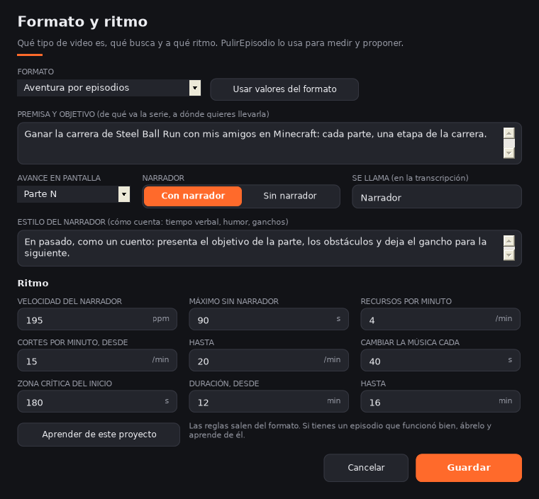

  - **Formato**: *100 días*, *Aventura por episodios*, *Serie de TV / anime*, *Retos /
    minijuegos*, *Video ensayo*, *Top / lista*, *Podcast* u *Otro*.
  - **Premisa y objetivo**: de qué va la serie y hacia dónde quieres llevarla.
  - **Avance en pantalla**: *Día N*, *Parte N*, *Etapa N*, *Ronda N*, *Acto N*, *Número N* o
    ninguno.
  - **Narrador**: si lo hay, cómo se llama su voz en la transcripción y su estilo.
  - **Reglas de ritmo**: velocidad del narrador (ppm), máximo sin narrador, recursos y cortes por
    minuto, cada cuánto cambiar la música, la zona crítica del inicio y la duración objetivo.

  **Usar valores del formato** carga unos valores de partida; los de *100 días* salen de
  [lo que funcionó en JoJoMania](docs/estilo-jojomania.md). **Aprender de este proyecto** mide el
  proyecto abierto en Vegas (un episodio que funcionó bien) y toma su ritmo como objetivo. La
  medición busca sola:
  - la pista principal y sus cortes;
  - la narración, con la transcripción y sin contar los memes de esa misma pista;
  - las grabaciones encima (POV), que cuentan una vez por aparición;
  - los textos, las imágenes y los efectos;
  - la música: audio largo, cada cambio de tema.

  Con Cap1 de JoJoMania da 18 cortes/min, narrador al 32 % a 199 ppm y música cada ~30 s.

  **Serie de TV / anime** arma cada capítulo como un episodio del anime de JoJo
  ([análisis](docs/estilo-anime-jojo.md), [estructura de SC](docs/estructura-episodio-sc.md)).
  Dura 15–18 min, usa «Etapa N» y un narrador al estilo de Johnny en SBR. **Plantilla y kit…**
  define los bloques de cada capítulo:

  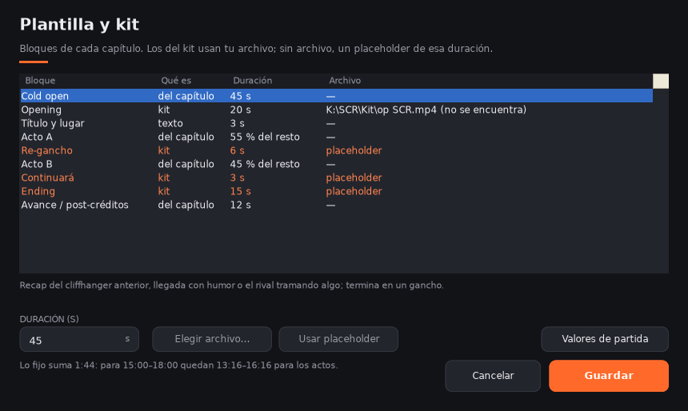

  | Bloque | Qué es | Duración |
  |---|---|---|
  | Cold open | del capítulo | 45 s |
  | Opening | kit | 20 s |
  | Título y lugar | texto | 3 s |
  | Acto A | del capítulo | 55 % del resto |
  | Re-gancho (tarjeta de stats o ranking) | kit | 6 s |
  | Acto B | del capítulo | 45 % del resto |
  | Continuará | kit | 3 s |
  | Ending | kit | 15 s |
  | Avance o post-créditos | del capítulo | 12 s |

  En los bloques del **kit** eliges tu archivo una sola vez (opening, eyecatch, «To Be
  Continued», ending) y se usa en todos los capítulos. Mientras no lo tengas, va un placeholder
  con esa duración.

**MomentosIA** y **Anteriormente** reconocen solos a qué serie pertenece el proyecto abierto
(su botón **Serie…** abre esta misma ventana para elegir otra o agregar el proyecto).
MomentosIA recibe el formato, la premisa, el papel y la nota del capítulo, las fichas de los capítulos anteriores (para conservar lo que continúa una
historia) y de los **posteriores** (para no cortar lo que prepara algo que se retoma después);
Anteriormente toma los capítulos anteriores con la ficha de los viejos (incluidas sus frases
clave) y el texto completo de los 2 más recientes.

### `ProducirCapitulo.cs`

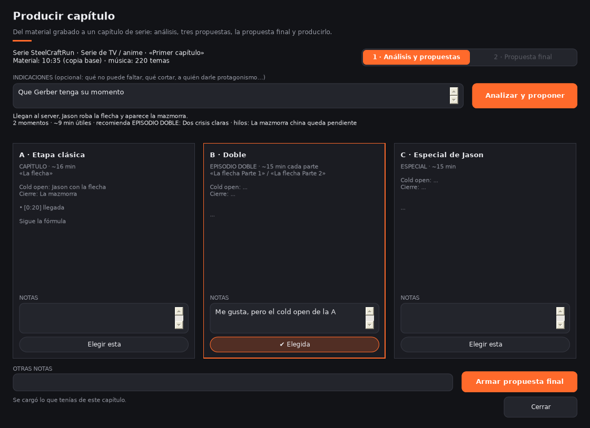

Arma un capítulo de serie a partir de todo el material grabado. Ábrelo en la **copia BASE** (la
que guarda PrepararEpisodio: sin silencios y transcrita). Usa la serie del capítulo: formato y
plantilla de bloques, premisa, papel y nota del capítulo, fichas de los capítulos anteriores y
posteriores, reparto y temas de cada personaje, y tu biblioteca de música.

**Quién habla…** (arriba) muestra el nombre de cada pista de voz. Si hablan varios por la misma,
escríbelos todos («Discord: Jason, Gerber y Ronnie»). Los nombres que pusiste en MomentosIA pasan
solos a la copia BASE; Gemini los recibe en cada línea de la transcripción y en una lista por
pista.

1. **Analizar y proponer.** Gemini lee todo el material con ese contexto y la estructura de
   referencia de SC y SBR (`docs/estructura-episodio-sc.md`). Devuelve:
   - los mejores momentos y los hilos con otros capítulos;
   - cuánto material útil hay y si da para más de un video;
   - **tres propuestas** distintas, cada una con su **tipo**:
     - *capítulo* normal;
     - *especial*;
     - *dos partes*: dos videos;
     - *doble duración*: un solo video largo, con un opening y las mitades unidas por un
       eyecatch.

     Además trae su **tipo de capítulo**, títulos al estilo JoJo, duración, su **estructura de bloques** (por ejemplo
     «Intro (3:00) → Título → Acto A → Eyecatch → Acto B»), qué cold open y qué cierre usa, una
     escaleta corta y por qué funciona.

   **Tipo de capítulo.** JoJo no arma todos los episodios igual: hay juegos y apuestas, misterios,
   persecuciones, capítulos de un personaje, del lado del villano, con el grupo separado,
   enfrentamientos en varias partes, despedidas, el estreno y más (23 tipos, en `docs/tipos-de-capitulo.md`).
   Gemini detecta de qué tipo es este capítulo. Para eso mira tus indicaciones y la nota del
   capítulo, el material, **qué número de capítulo es**, **cómo cerró el anterior** y qué tipos
   se usaron hace poco, para no repetir. Las propuestas pueden ser de tipos distintos.
   - Si ya sabes qué quieres, elígelo en el combo **Tipo de capítulo**: las tres propuestas serán
     de ese tipo.
   - Si el material no encaja con el papel del capítulo (por ejemplo, alguien muere y estaba como
     «Normal»), la ventana sugiere cambiarlo.
   - Al producir, la serie guarda el tipo, el título y el cierre del capítulo para el siguiente.

   **Opciones.** Cada casilla tiene tres estados (clic para cambiar): ◌ que decida la IA, ✔ sí, ✖ no.
   Lo que marcas con ✔ o ✖ es obligatorio para Gemini.
   - Casillas: inicio cinematográfico, presentar a cada personaje (con su tarjeta), contexto antes de
     cada escena, solo charla del juego, cold open, recap del anterior, opening, eyecatch,
     «continuará», ending, avance, narración, carteles, stats y doble duración.
   - Al lado van la **duración del video terminado** y el **volumen de la música**. Las propuestas
     se ajustan a esa duración, nunca al largo del material, y avisan con ⚠ si se pasan.
   - En el primer capítulo ya vienen marcados el inicio cinematográfico, las presentaciones y el
     contexto antes de cada escena, y el tipo «Estreno». En el 2 y el 3, el inicio cinematográfico.

   Siempre hay **tres propuestas**: si Gemini devuelve menos, se piden las que faltan. Las tres
   cubren el **mismo material** y los mismos momentos fuertes; cambia el enfoque (cómo abre, qué
   destaca, el orden, desde quién se cuenta, cómo cierra).

   **Privacidad y soporte técnico.** Nunca entran charlas personales del mundo real (familia,
   trabajo, escuela, salud, datos) ni el soporte para instalar o actualizar el juego (launcher,
   AnyDesk, Java, lag, «¿me escuchan?»). La transcripción que recibe Gemini marca esas frases y
   las zonas donde se juntan, y en la escaleta final los clips que las tocan salen con ⚠ para
   que los revises.

   **Fidelidad.** Títulos, lugares y escaleta tienen que salir del material, no del anime ni de
   capítulos posteriores. La tarjeta avisa con ⚠ de los nombres propios que no aparecen en la
   transcripción (por ejemplo «Palma, Diablo»). **Refinar** los corrige aunque no escribas notas,
   y la escaleta final tampoco los usa. Clic en el texto de una tarjeta para leerla completa.

   Cada tarjeta tiene su cuadro de **notas** («sin opening», «con el cold open de la A»).
   **Refinar propuestas** corrige las tres con tus notas sin volver a analizar todo, las veces
   que quieras. Después elige una.
2. **Armar propuesta final.** La escaleta completa. **Tus indicaciones, notas y cambios mandan**
   sobre la plantilla y las reglas: la estructura de cada capítulo la decide la propuesta con tus
   notas, sin opening si lo pides, con intro más larga, con eyecatch entre mitades, etc. La
   plantilla es solo el punto de partida.

   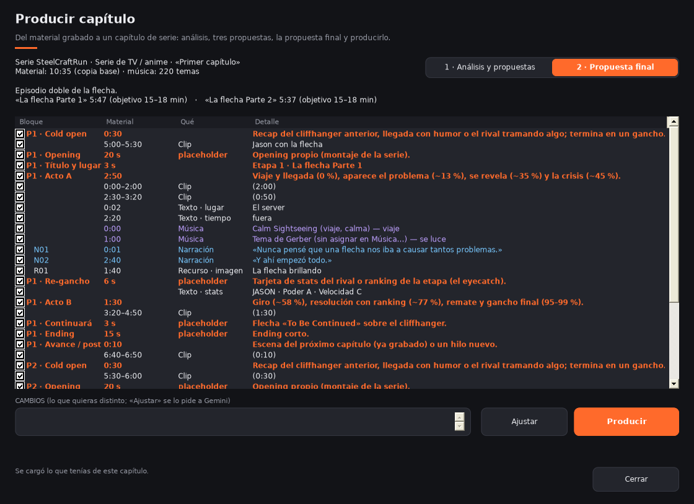

   - **clips** del material en el orden en que se verán. Ningún tramo se repite: lo que ya salió
     en el cold open se recorta de los actos. El **recap** es del capítulo anterior y el
     **avance** del próximo, así que no usan clips de este material: quedan como placeholder
     (salvo en un capítulo de dos partes, donde el avance de la 1 y el recap de la 2 sí);
   - **textos**: título «Etapa N · nombre», carteles de lugar y tiempo, ranking, tarjeta de
     stats del rival para el re-gancho y «continuará»;
   - **música** de tu biblioteca por escena (sin repetir dentro del capítulo), con el tema del
     personaje cuando se luce y el principal en el momento clave;
   - **ritmo** de cada bloque (lento, medio o rápido) según lo que pasa: rápido en acción y humor,
     lento en llegadas, revelaciones, momentos emotivos y el cliffhanger. Los clips que lo
     necesitan llevan un **respiro** de 0.5 a 3 s;
   - **narración** a tu velocidad, solo en las pausas donde no habla nadie;
   - **recursos** que faltan.

   Arriba ves cuánto dura cada parte contra el objetivo. Si la escaleta queda **corta o larga**
   para la duración que pediste, se corrige sola hasta dos veces: a Gemini se le dice cuánto
   falta o sobra y qué tramos del material no usó. Desmarca lo que no quieras, escribe
   **cambios** y pulsa **Ajustar** las veces que haga falta. Doble clic en una fila lleva a ese
   momento del material.
3. **Producir.** Guarda una copia `<capítulo> CAP.veg` y arma ahí el capítulo; la BASE no se
   toca:
   - cada clip con todas sus pistas (video, voces y juego), agrupados, en la estructura de la
     escaleta;
   - los **respiros**: el clip se alarga sobre la grabación original y recupera la pausa que se
     había quitado;
   - el **kit** de la serie, o placeholders con la duración de cada bloque;
   - el título y los carteles con el estilo de texto del proyecto;
   - la **música colocada sin balancear** (eso va en *PasoFinal*), con la pista a −21 dB (o lo que
     elijas en la ventana);
   - la narración provisional con la voz de Windows, en el hueco libre más cercano a su momento.
     Como el material ya no tiene silencios, casi nunca hay pausas largas: si la frase no cabe,
     el clip se **alarga** lo que falta (el video y el sonido del juego siguen; las voces se
     callan) y la frase va ahí, sin pisar a nadie;
   - los placeholders de recursos (si al abrir tenías seleccionada una imagen editada, la
     copian con sus efectos);
   - una región por bloque y otra por parte.

   El material se quita y el capítulo queda al inicio. Un **episodio doble** queda en el mismo
   proyecto: «PARTE 1» y «PARTE 2», cada una con su región para exportarla. Junto al proyecto
   se guarda el **guion** de la narración y los recursos.

Todo se guarda en `<proyecto>.vegascut-produccion.json`: al volver a abrir sigues donde lo
dejaste.

### `PasoFinal.cs`

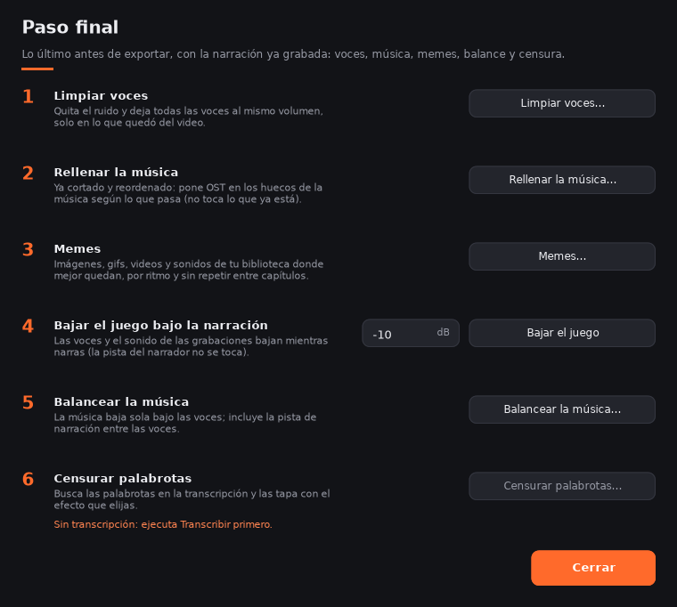

Lo último antes de exportar, con la narración ya grabada:

1. **Rellenar la música**: para cuando ya cortaste, editaste y reordenaste el capítulo producido.

   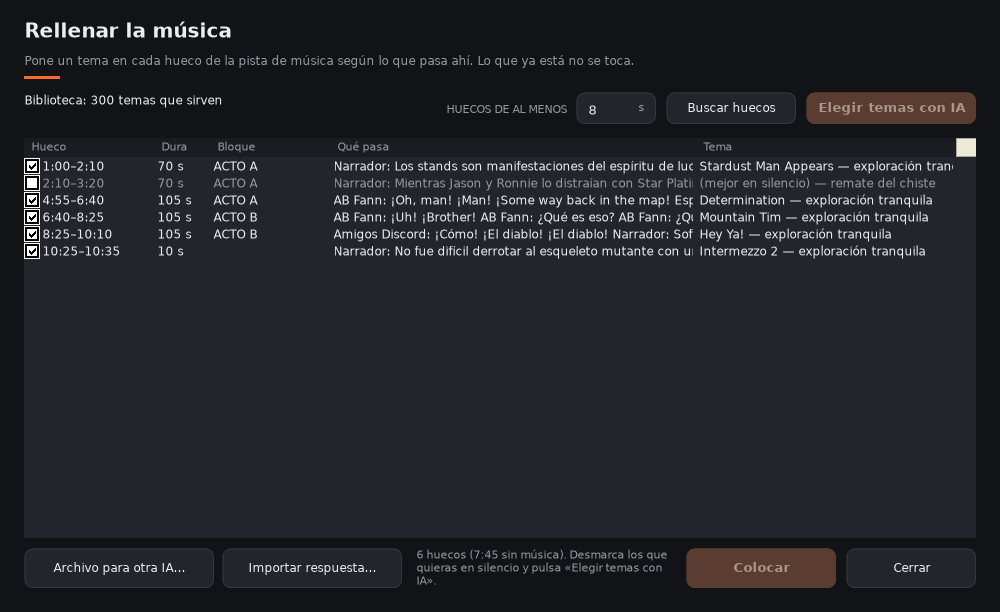

   - **Buscar huecos** encuentra los tramos sin música en la pista de música, sin contar el
     opening, el ending ni los demás bloques del kit. Sirve también para videos hechos con
     MomentosIA: cuenta como pista de música la que se llama «Música», «Music», «OST» o
     «BGM», y cualquier pista cuyos audios vengan de la carpeta de la biblioteca. Por defecto busca huecos de 8 s o más; los
     de más de 2 min se parten, en el borde de un bloque si hay uno cerca.
   - Cada hueco muestra lo que se dice ahí (la transcripción sigue tus cortes) y su bloque.
   - **Elegir temas con IA**: Gemini elige un tema de tu biblioteca para cada hueco según lo que
     pasa, lo que suena antes y después, y lo que ya suena en el capítulo (sin repetir). Usa el
     tema del personaje cuando ese personaje se luce. Si un hueco queda mejor en silencio (un
     remate o un momento dramático), lo dice y lo desmarca.
   - Revisa, desmarca lo que no quieras y pulsa **Colocar**: los temas van a la pista de música
     con fundidos y a −21 dB. **Lo que ya estaba no se toca.** Si un tema dura menos que su hueco,
     queda el resto libre y puedes volver a buscar.
2. **Memes**: imágenes, gifs, videos cortos y sonidos de tu carpeta de memes, donde mejor quedan.

   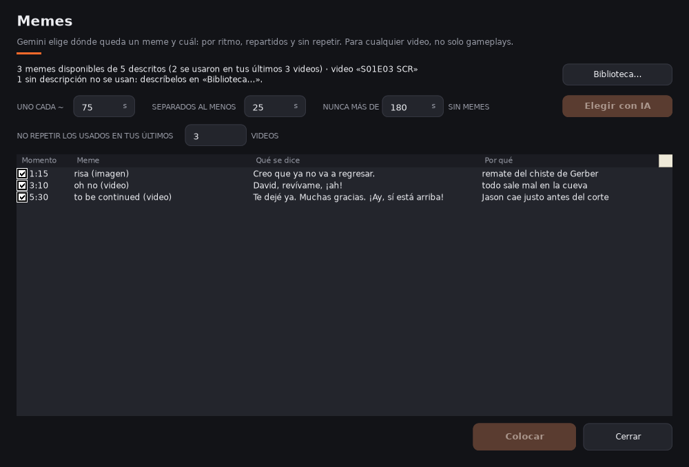

   - **Biblioteca…**: eliges la carpeta una vez (se recuerda para todas las series) y **Buscar
     archivos** la indexa. Las subcarpetas cuentan como tags (`Reacciones/Risa`).
     - **Describir con IA**: Gemini *ve* las imágenes y los gifs (se le mandan miniaturas), y los
       videos y sonidos cortos (enteros, hasta ~15 MB por pedido), y dice qué son, sus tags y
       cuándo usarlos. Lo que no puede ver y no sabe qué es por su nombre, lo deja sin describir.
     - Para revisar una carpeta grande donde no todo es meme, usa el programa aparte
       `programas/Memes.exe` (más abajo).
     - Corriges o escribes a mano qué es cada uno, sus tags y cuándo usarlo. Doble clic lo abre.
       Un meme sin descripción no se usa.
     - El índice queda en `memes-indice.json`, dentro de la carpeta.

     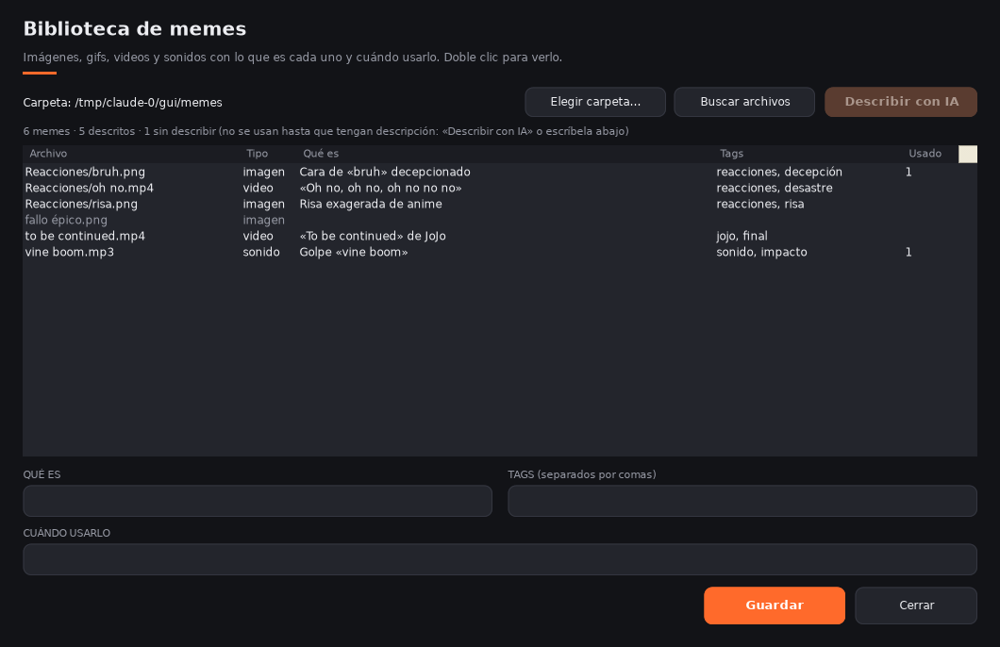
   - **Elegir con IA**: Gemini lee el capítulo (transcripción y marcadores) y propone memes **por
     ritmo**. Eliges cada cuánto en promedio (~75 s), la separación mínima (25 s) y cuántos
     capítulos atrás no se repiten (3). Va en remates, fallos, sorpresas o victorias, nunca en
     momentos serios ni encima del opening o el ending. Las reglas se aplican aunque Gemini no las
     cumpla.
   - **Colocar**: las imágenes y videos van a la pista «vegas-cut · Memes», arriba de todo, y los
     sonidos (y el audio de los videos) a «vegas-cut · Memes (audio)». Cada meme usado queda
     anotado con su capítulo para no repetirlo en los siguientes.
3. **Bajar el juego bajo la narración**: las voces y el sonido de las grabaciones bajan los dB
   que elijas mientras narras (la pista del narrador no se toca).
4. **Balancear la música**: abre *Música que baja sola*; incluye la narración entre las voces.
5. **Censurar palabrotas**: abre *Censurar palabrotas*.

### `VariosPOV.cs`

Para cuando otro jugador también grabó su pantalla. Dos pasos:

**1. Sincronizar** (antes de quitar silencios).

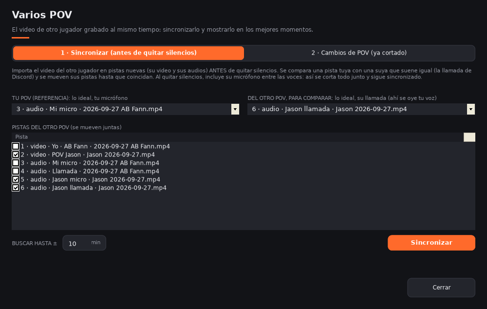

1. Importa su video en pistas nuevas (su video y sus audios), donde sea.
2. Elige una pista tuya y una suya que suenen igual. Lo ideal: **tu micrófono** contra **su
   llamada**, porque en su llamada se oye tu voz.
3. Las pistas de su archivo se marcan solas como «del otro POV».
4. **Sincronizar** escucha las dos pistas, compara el ritmo de las voces y encuentra cuánto
   está corrido (al centésimo de segundo). Busca hasta ±10 min; el número se cambia. Te dice el
   desfase y una **confianza**:
   - alta: es seguro;
   - baja: probablemente las pistas no tienen voces en común.
5. Si aceptas, mueve juntas todas sus pistas. Ctrl+Z lo deshace.

Sincronízalo **antes** de quitar silencios, como pensabas: cada grabación tiene sus propios
silencios, y si se cortaran por separado se desfasarían. Después *QuitarSilencios* o
*PrepararEpisodio* cortan **todas las pistas a la vez**, así que sigue sincronizado.
- Incluye **su micrófono entre las voces**, para que no se corte cuando él habla.
- Transcríbelo también: así el paso 2 sabe qué dice.

**2. Cambios de POV** (ya cortado y transcrito).

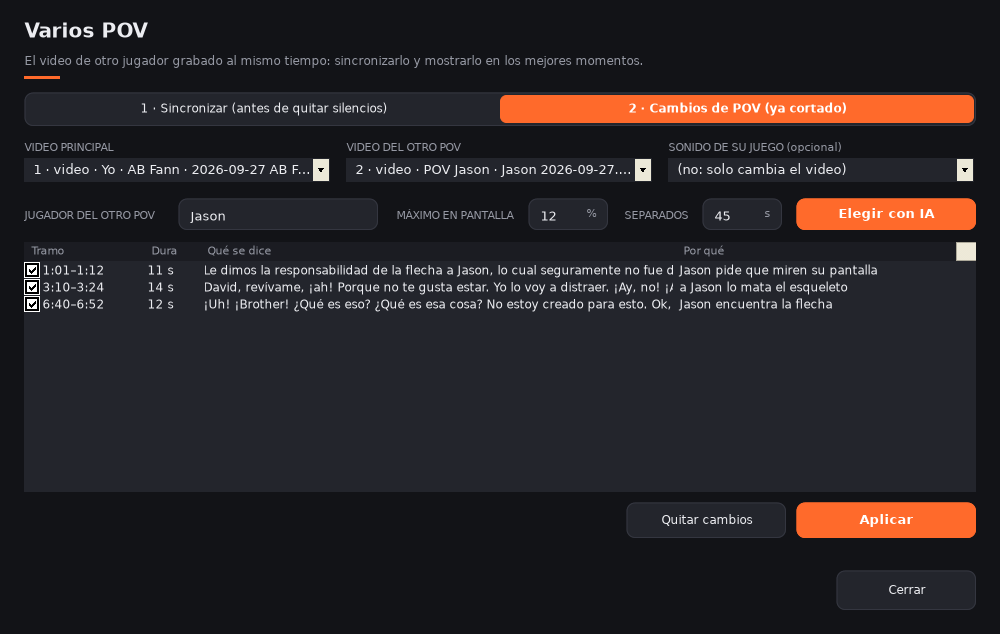

- Eliges el video principal (tu POV, el que manda), el del otro y, si quieres, el sonido de su
  juego. Se preseleccionan solos.
- **Elegir con IA**: Gemini lee la transcripción y los marcadores y elige los pocos momentos en
  que conviene ver su pantalla:
  - cuando pide que miren («mira», «miren», «ven a ver»);
  - cuando le pasa algo (muere, cae, encuentra algo, lo atacan);
  - cuando él hace lo importante y tu POV no lo ve.
- Tramos de 4 a 20 s, que empiezan un poco antes de lo que pasa. Como mucho el 12 % del video y
  separados al menos 45 s; los dos números se cambian. Las reglas se aplican aunque Gemini no las
  cumpla.
- **Aplicar**: parte los eventos en esos tramos. Ahí se ve su POV (y suena su juego, si lo
  elegiste) y tu video se silencia; en el resto, al revés. No se borra nada: son eventos
  silenciados que puedes ajustar a mano. **Quitar cambios** vuelve a dejar solo tu POV.

### `programas/Memes.exe` (programa aparte)

No es un script de Vegas: es un programa normal de Windows para trabajar tu biblioteca de memes
sin abrir Vegas. Doble clic en `Memes.exe`. Si Windows avisa «Windows protegió su PC» (el
programa no está firmado), **Más información → Ejecutar de todas formas**. También puedes
compilarlo tú: `Memes.bat` lo compila desde `Memes.cs` con el compilador de C# que ya trae
Windows y lo abre. Usa la misma configuración que los scripts, así que ya tiene tu clave de
Gemini y tu carpeta de memes.

Arriba eliges la carpeta **A** (tu carpeta de memes, la misma que usa *PasoFinal*) y cambias
entre las dos vistas.

**Clasificar (swipe)**: para una carpeta llena de videos e imágenes donde no todo es meme.

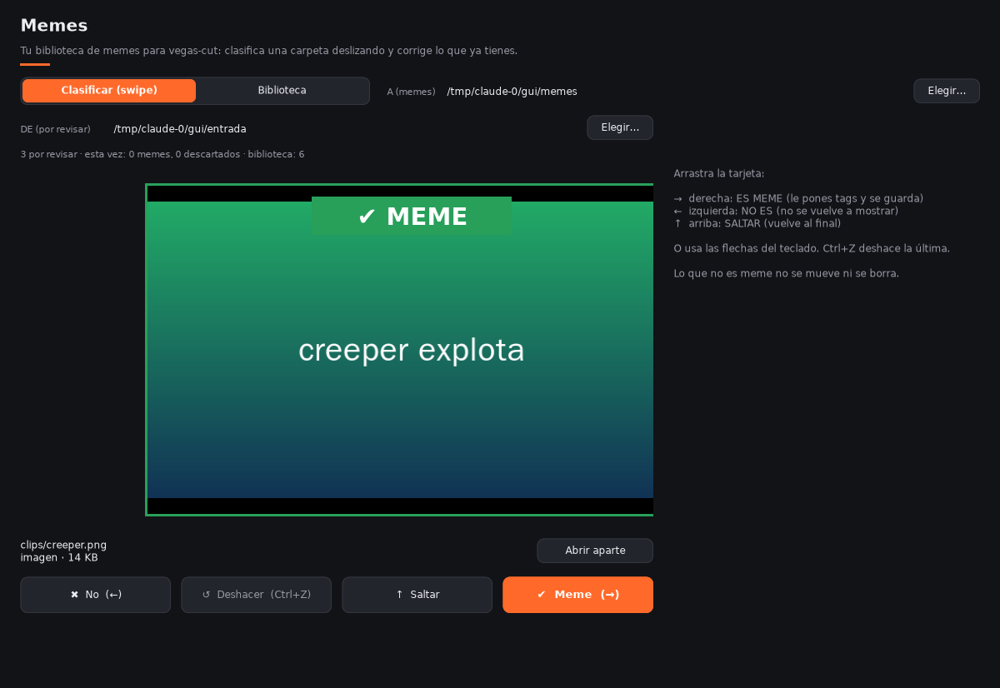

1. Elige una vez la carpeta **DE** (lo que hay que revisar). Se recuerda.
2. Sale una tarjeta por archivo: las imágenes, y los videos, gifs y sonidos en bucle. Si un
   formato no se ve (`.webm`, `.mkv`), está **Abrir aparte**.
3. Arrastra la tarjeta con el mouse (o usa las flechas del teclado):
   - **→ derecha: es meme.** Pasa a los tags.
   - **← izquierda: no es.** El archivo no se mueve ni se borra; solo no se vuelve a mostrar.
   - **↑ arriba: saltar.** Vuelve al final de la fila.
   - **Ctrl+Z** (o **Deshacer**) deshace la última, aunque ya lo hayas guardado: el archivo
     vuelve a su carpeta.

   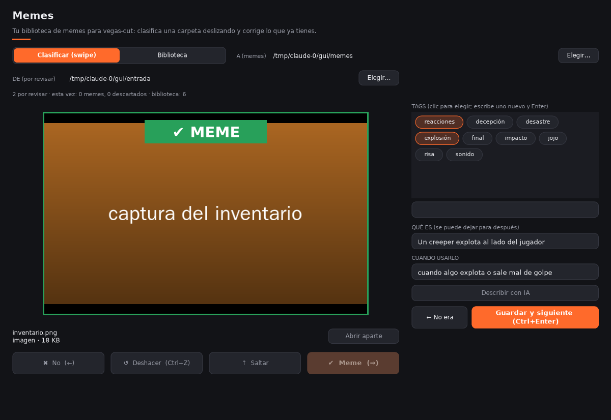
4. **Tags**: tus tags salen como botones, de los más usados a los menos; clic para elegir.
   Escribe uno nuevo y Enter para crearlo.
5. **Qué es** y **cuándo usarlo** (puedes dejarlos vacíos y describirlos luego).
   **Describir con IA** los llena: de imágenes y gifs Gemini ve una miniatura; de videos y
   sonidos de hasta 18 MB, el archivo entero; usa primero tus tags.
6. **Guardar y siguiente (Ctrl+Enter)**: el archivo **se mueve** a tu carpeta de memes (con
   otro nombre si ya hay uno igual) y queda en `memes-indice.json`. **No era meme** lo descarta.

**Biblioteca**: todo lo que ya tienes.

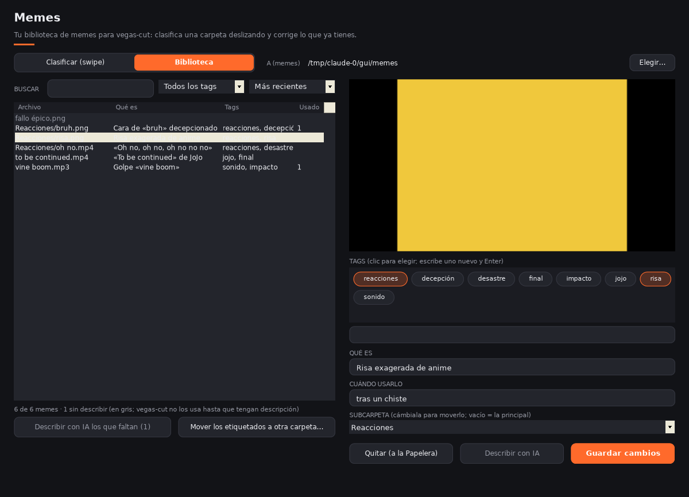

- Busca por texto y filtra por tag. Los que no tienen descripción salen en gris: vegas-cut no
  los usa hasta que la tengan. **Describir con IA los que faltan** los hace de una vez.
- Al elegir uno se ve y se reproduce; corriges sus tags, qué es y cuándo usarlo, y
  **Guardar cambios**. La columna *Usado* dice en cuántos capítulos ya salió.
- **Quitar** lo manda a la Papelera y lo saca del índice.

### `LimpiarVegasCut.cs`

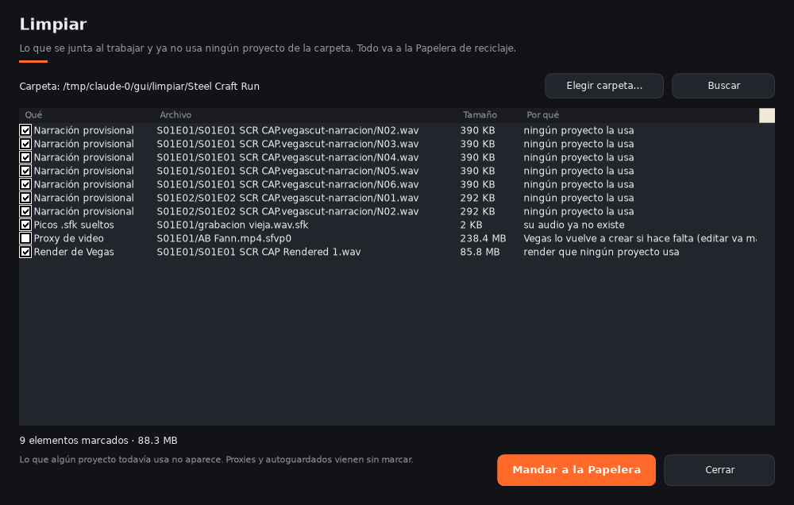

Para cuando ya terminaste capítulos. Abre la carpeta de la serie del proyecto abierto (o la del
proyecto; **Elegir carpeta…** para otra), revisa también las subcarpetas y lista lo que ya no
hace falta:

| Qué | Cuándo aparece | Marcado |
|---|---|---|
| **Temporales de vegas-cut** en `%TEMP%` | Audios de transcribir o carpetas de Whisper de más de un día (quedan si Vegas se cerró a mitad) | Sí |
| **Narración provisional** (`.vegascut-narracion\N01.wav`…) | Ningún `.veg` de la carpeta la usa: la reemplazaste por la tuya o sobró de una versión anterior | Sí |
| **Renders de Vegas** («Renderizar en nueva pista»: archivos con *render* en el nombre) | Ningún `.veg` los usa | Sí |
| **Picos `.sfk` sueltos** | Su audio ya no existe | Sí |
| **Proxies** (`.sfvp0`) | Siempre; Vegas los regenera, pero editar va más lento mientras | No |
| **Autoguardados** (`.bak`) | De más de una semana | No |

- Para saber qué se usa, busca el nombre de cada archivo dentro de los `.veg` de la carpeta. Los
  medios del proyecto abierto cuentan como usados aunque no lo hayas guardado.
- Si no puede leer las rutas de los proyectos, no ofrece nada de la carpeta, solo los
  temporales.
- **Nunca toca** grabaciones, proyectos, transcripciones, fichas ni archivos de serie.
- Todo va a la **Papelera de reciclaje**: se puede recuperar mientras no la vacíes. Las carpetas
  de narración que quedan vacías también se van.

### `PulirEpisodio.cs`

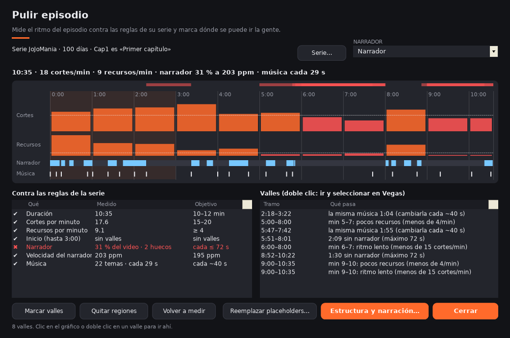

Para después de MomentosIA, con el episodio ya cortado; no hay que volver a transcribir. Mide el
ritmo y lo compara con las reglas de su serie (**Series → Formato y ritmo**), ajustadas al papel
del capítulo: por ejemplo, el primero es más exigente con el narrador y un final puede durar más.

- **Gráfico minuto a minuto:** cortes y recursos (en rojo los minutos bajo la regla, con la línea
  punteada como mínimo), la narración, cada cambio de música, la zona crítica del inicio
  sombreada y los valles arriba. Un clic lleva el cursor de Vegas a ese momento.
- **Contra las reglas de la serie:** duración, cortes y recursos por minuto, valles en el inicio,
  huecos sin narrador, velocidad del narrador y música.
- **Valles:** tramos sin narrador más largos que la regla, minutos seguidos con pocos recursos o
  ritmo lento, música que no cambia y duración de más. Los de la zona crítica van primero, en
  rojo. Doble clic: va ahí y lo selecciona en la línea de tiempo.
- **Marcar valles:** pone regiones «VALLE · …». **Quitar regiones** borra solo esas.
- **Narrador:** se elige la voz de la transcripción. Si la serie lleva narrador pero aún no hay
  narración, los huecos de narrador no cuentan; la narración provisional sí cuenta.

#### Estructura y narración…

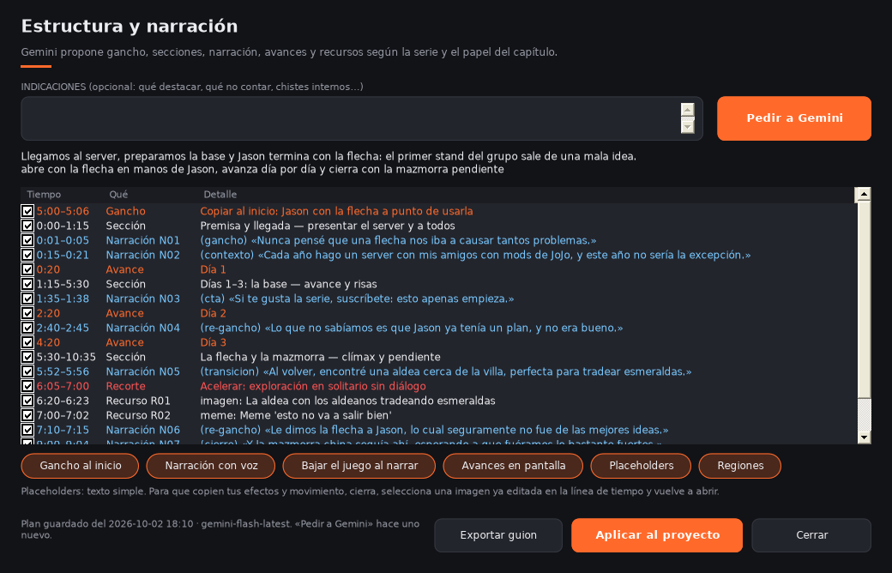

**Pedir a Gemini** le manda:
- lo que se dice en el video, con los tiempos actuales, y las pausas donde nadie habla;
- el informe de ritmo;
- la serie: formato, premisa, estilo del narrador, papel y nota del capítulo, fichas de los
  capítulos anteriores y **cómo abrieron**, para no repetir el mismo inicio;
- tus indicaciones, si escribes alguna.

Gemini propone:

- **Gancho:** un momento fuerte de 3 a 8 s para mostrar al inicio.
- **Secciones** del episodio.
- **Narración** en el estilo de la serie, medida a tu velocidad (ppm). Incluye una frase de gancho
  en los primeros 7 s, contexto antes de los 30 s, un re-gancho en la zona crítica, la invitación
  a suscribirse en el minuto 1–3 y el adelanto del siguiente capítulo (no en el final de la serie).
  Va en las pausas o sobre charla sin importancia.
- **Avances** en pantalla («Día 3», «Etapa 2»…).
- **Recursos** que faltan (imagen, meme, efecto, texto o zoom), sobre todo en los valles, cada uno
  con su código R01, R02…
- **Recortes**: qué quitar o acelerar si dura de más.

Desmarca lo que no quieras (doble clic en una fila te lleva a ese momento) y elige qué aplicar:

- **Gancho al inicio:** corre todo el video y copia ese momento al principio (video y audios, con
  región «GANCHO»). La transcripción sigue funcionando: siempre se ubica en el momento original.
- **Narración con voz:** cada frase con la voz de Windows (robótica a propósito), ajustada a tu
  velocidad, en la pista «vegas-cut · Narración provisional». Los WAV quedan en
  `<proyecto>.vegascut-narracion`.
- **Bajar el juego al narrar:** baja las pistas de las grabaciones (voces y juego) mientras suena
  la narración. La del narrador no se toca.
- **Avances en pantalla:** textos con el estilo del texto que ya uses en el proyecto (pista
  «vegas-cut · Avances»).
- **Placeholders:** si antes de abrir PulirEpisodio seleccionas en la línea de tiempo una imagen
  ya editada, cada placeholder es una **copia** de ella (efectos, movimiento y fundidos) con un
  texto «[R03] IMAGEN: …» en lugar de la imagen. Si no, un texto simple. Pista
  «vegas-cut · Placeholders».
- **Regiones:** «SECCIÓN · …», «RECORTAR · …» y «ACELERAR · …». Los recortes no se aplican solos.

Todo queda en un solo paso de deshacer (Ctrl+Z). Al aplicar se guarda el **guion**
(`<proyecto>.vegascut-guion.txt`): las frases con su código (N01…) y su tiempo, y la lista de
recursos con el nombre de archivo sugerido. **Exportar guion** lo abre. El plan se guarda en
`<proyecto>.vegascut-plan.json` (con lo que desmarcaste), así no hay que volver a pedirlo.

**Reemplazar placeholders…:** eliges la carpeta con tus imágenes o videos. Cada archivo debe
empezar con el código del placeholder (`R03 cadaver de steve.png`; se busca también en
subcarpetas). Pasa a ser la toma activa del placeholder y conserva sus efectos, movimiento y
fundidos. Avisa de los que falten.

Próximamente: **Reemplazar narración**. Grabarás el guion de corrido y cada frase irá al lugar
de la voz robótica.

### `Anteriormente.cs`

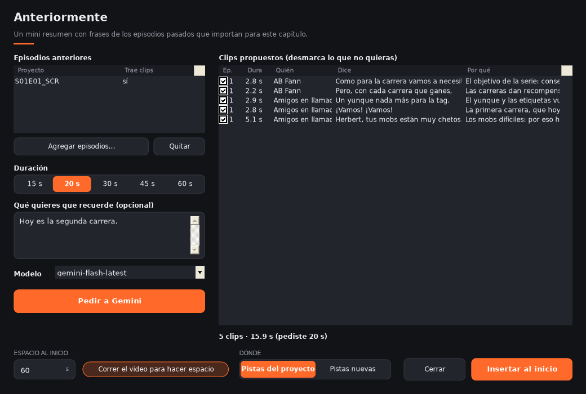

Arma el «ANTERIORMENTE» que abre un episodio, con frases dichas en los episodios pasados.

1. Los capítulos anteriores de la serie se cargan solos (ver `Series.cs`); con **Agregar…** sumas
   otros `.veg` a mano. Para
   poder traer sus clips, su transcripción tiene que ser de esta versión de *Transcribir* (la
   columna *Trae clips* lo dice); si no, sirven solo de contexto.
2. Elige la **duración** (15, 20, 30, 45 o 60 s) y, si quieres, qué recordar («hoy es la
   segunda carrera»).
3. **Pedir a Gemini**: lee lo que quedó en cada episodio anterior (sin lo que se cortó con
   las herramientas) y de qué trata el actual (su resumen de MomentosIA o su transcripción), y
   elige frases cortas que importan para **este** capítulo: objetivos, conflictos, promesas, o un
   detalle pequeño que aquí se vuelve importante.
4. Revisa la lista y desmarca lo que no quieras.
5. **Insertar al inicio**: corre todo el video (eventos, marcadores y regiones) para dejar
   **espacio al inicio** (60 s por defecto, o lo que haga falta) y pone los clips en orden desde
   0:00, sacados **directo de las grabaciones originales** (video y cada audio), cada clip
   agrupado con sus audios. Van en las **pistas del proyecto** (cada voz a la pista con su misma
   etiqueta, A2, A3…) o en **pistas nuevas**. Deja una región *ANTERIORMENTE* y un marcador
   `TEXTO: Anteriormente…` para convertirlo en título con *TextosDesdeMarcadores*. Si el video ya
   empieza después del espacio, no se corre otra vez. Ctrl+Z lo deshace.

### `DesenlazarClips.cs`

Al cortar por script, Vegas deja cada pedazo nuevo en el mismo grupo que el clip original, así
que con versiones anteriores de *Quitar silencios* y *MomentosIA* todos los pedazos quedaban
unidos: mover o borrar uno movía o borraba todos. Ahora las herramientas lo corrigen solas al
terminar de cortar. Para proyectos que ya quedaron así, ejecuta **DesenlazarClips**: cada
pedazo vuelve a su propio grupo y **el video sigue unido a sus audios** de ese pedazo (los
eventos que coinciden en el tiempo). Solo toca grupos con dos o más eventos en la misma pista.
Ctrl+Z lo deshace.

### `PrepararEpisodio.cs`

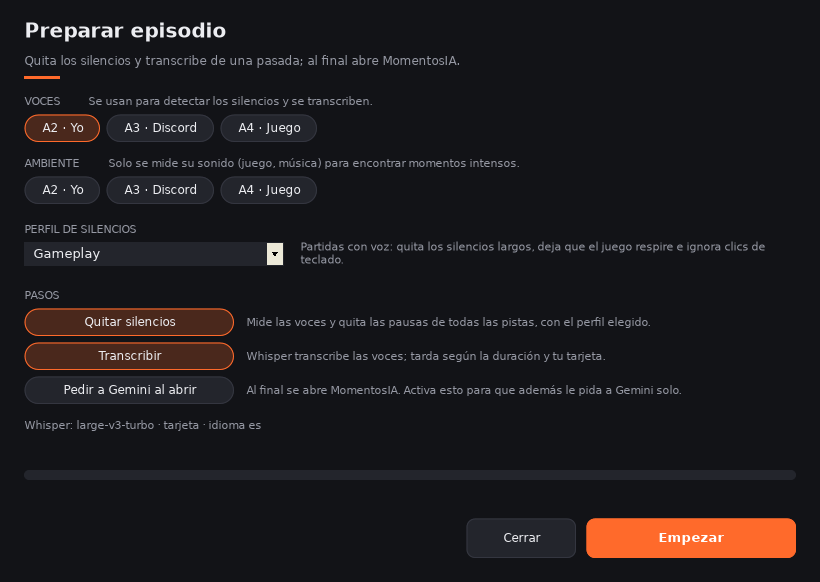

Todo de una pasada sobre la grabación, para dejarlo corriendo:

1. **Quitar silencios**: mide las voces que marques, detecta las pausas con el umbral de cada
   pista y el **perfil** elegido (Gameplay, Narración…, o uno tuyo) y las quita de todas las
   pistas.
2. **Transcribir**: Whisper transcribe las voces y mide el ambiente, igual que *Transcribir*.
3. Guarda una **copia base**: `<proyecto> BASE.veg`, sin silencios y con su transcripción (y su
   serie). Sigues trabajando en el proyecto original. Desde la copia base puedes volver a
   empezar MomentosIA o la producción del capítulo sin repetir estos pasos. Las series la
   reconocen como el mismo capítulo.
4. Abre **MomentosIA** con todo listo. Con **Pedir a Gemini al abrir** también le pide la
   propuesta solo.

Recuerda las pistas (por etiqueta: A2, A3…), el perfil y los pasos para el próximo episodio.
Puedes saltarte un paso (por ejemplo, si ya quitaste los silencios). Cada paso es su propio
Ctrl+Z; si uno falla se detiene y te dice dónde.

### `QuitarSilencios.cs`

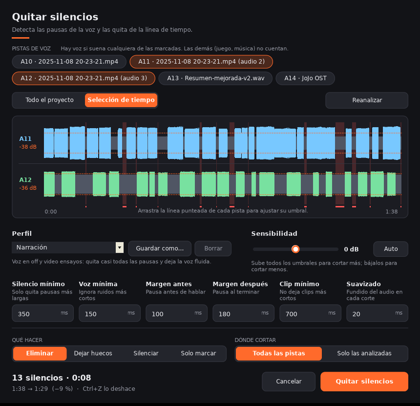

Detecta las pausas de una o varias pistas de voz y las quita de la línea de tiempo.

1. Guarda el proyecto y ejecuta el script (ver *Instalación*).
2. Marca las **pistas de voz**: por ejemplo tu micrófono y la llamada. Hay voz si suena
   **cualquiera** de ellas, así que cuando hablan los dos a la vez se conserva todo. Las pistas
   sin marcar (juego, música) no cuentan para detectar, pero con *Todas las pistas* se cortan
   igual para que todo siga sincronizado. Pasa el ratón sobre una pista para ver su detalle.
   Si pones nombre a las pistas en Vegas ("Voz", "Llamada", "Juego") aparece ese nombre.
3. Elige el **rango** (todo el proyecto o la selección de tiempo) y pulsa **Analizar**: Vegas
   renderiza cada pista marcada a un WAV temporal y se mide el volumen cada 10 ms.
4. Ajusta mirando la onda (un carril por pista; en rojo lo que se quitará):
   - **Umbral por pista**: cada pista recibe su propio umbral según su ruido de fondo y su voz
     (se separan los dos grupos de niveles con el método de Otsu y el umbral queda entre ambos).
     Así una pista más baja o con más ruido no arruina la detección de las demás. Arrastra la
     línea punteada de un carril para ajustar solo esa pista; **Auto** los recalcula todos.
   - **Sensibilidad**: sube (corta más) o baja (corta menos) todos los umbrales a la vez.
   - **Perfil**: valores listos para cada tipo de video. Si cambias algo, *Guardar como…* crea
     un perfil tuyo (marcado con ★); los tuyos se pueden borrar.
   - **Silencio mínimo**, **voz mínima** (ignora clics y respiraciones), **margen antes** y
     **después**, **clip mínimo** (no deja pedazos más cortos, evita saltos) y **suavizado**
     (fundido corto del audio en cada corte para que no se oiga un chasquido).

   | Perfil | Silencio mín. | Voz mín. | Antes | Después | Clip mín. | Suavizado | Sensib. |
   |---|---|---|---|---|---|---|---|
   | Narración (video ensayos) | 350 | 150 | 100 | 180 | 700 | 20 | 0 |
   | Tutorial | 600 | 150 | 150 | 300 | 1000 | 25 | 0 |
   | Podcast / charla | 900 | 200 | 200 | 350 | 1500 | 30 | 0 |
   | Gameplay | 1200 | 250 | 250 | 450 | 2000 | 30 | −3 |
   | Shorts / rápido | 200 | 100 | 50 | 80 | 400 | 15 | +2 |

   Valores en ms (sensibilidad en dB).
5. Elige qué hacer: **Eliminar** (corta y junta todo), **Dejar huecos** (quita sin mover),
   **Silenciar** (corta y deja mudo) o **Solo marcar** (crea regiones "Silencio" para revisarlas),
   y dónde cortar: **todas las pistas** o **solo las analizadas**.
6. Todo queda en un solo paso de deshacer: **Ctrl+Z** lo revierte.

Los ajustes se recuerdan en `%APPDATA%\vegas-cut\silencios.ini` y los perfiles propios en `perfiles.ini`, en la misma carpeta.

### `ExportarProyecto.cs`

Exporta proyectos a JSON con:

- Configuración: resolución, fps, frecuencia de audio.
- Media usada, incluidos generadores (Títulos y Texto, color sólido).
- Pistas: volumen, paneo, efectos de pista y envolventes.
- Eventos: inicio, duración, parte del archivo original (`offset`), velocidad,
  fundidos, ganancia, efectos con sus parámetros y keyframes de Pan/Crop
  (con `zoom` calculado).
- Marcadores y regiones.

**Uso:** en Vegas 20, *Herramientas → Secuencias de comandos → Ejecutar
secuencia de comandos…* (*Tools → Scripting → Run Script…*) → elige
`ExportarProyecto.cs`. Pregunta el modo:

- **No → solo el proyecto abierto.** Crea `<proyecto>.export.json` junto al `.veg`.
- **Sí → carpeta completa.** Eliges una carpeta y abre cada `.veg` (con
  subcarpetas), crea su JSON junto al `.veg` y deja una copia de todos en
  `<carpeta>\_vegas-cut-export\`, con un `exportacion.log`. Salta los
  proyectos cuyo JSON ya está al día, así que se puede repetir sin perder tiempo.
  Guarda el proyecto abierto antes de empezar. Si Vegas avisa de archivos que no
  encuentra, elige ignorar para que siga.

Para tenerlo siempre en el menú, copia el `.cs` a
`Documentos\Vegas Script Menu\` y usa *Tools → Scripting → Rescan Script Menu Folder*.

Para analizar, sube la carpeta `_vegas-cut-export` (o los `.export.json`).

## Desarrollo

- El código vive en `src/`. Después de cambiarlo: `python3 herramientas/compilar.py`.
- Los scripts son C# 5 (el compilador de Vegas) y quedan en ASCII (acentos como `\uXXXX`).
- Pruebas sin Vegas: `sh pruebas/ejecutar.sh` (requiere mono y python3). Compila todo contra una
  API falsa de Vegas e imita Whisper y Gemini.
